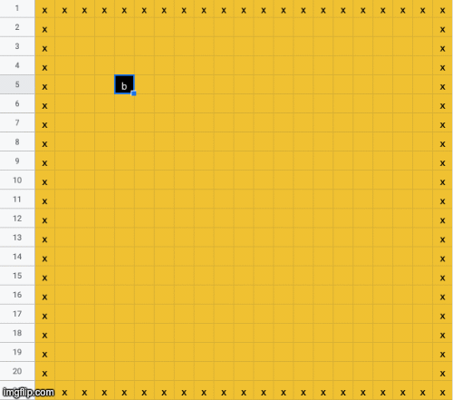

# Implementing Go in Excel

## Acknowledgements
Thank you to Jackson Stogel for aiding in the initial design of the algorithm. Thank you to Google for Google Sheets.

## Link to spreadsheet
[Go in a spreadsheet](https://docs.google.com/spreadsheets/d/1gG7IEcn6ETNCPRCLQVSyg1UzcpmbLMmCHvcSHdFltUw/edit#gid=0)

## Demo

A modern joseki (go term for "opening") in Excel.

## Usage

Enter in one letter at a time ("b" or "w") exactly into the grid on `board`. When cells become red, delete them from the board (captures). You'll find that entire process of entering and waiting for the move to be colored takes around 7-10 seconds because of our Excel computational scheme. In a normal game, this hopefully will not be an issue. If you want to play a bunch of moves both sides know they are going to play anyway, you can input them fast with no breaking of code. Share with a friend to play a game over Google Drive!

## Objective

The objective of this project was to implement a fully-functioning game of [Go](https://en.wikipedia.org/wiki/Go\_\(game\)) entirely in Google Sheets. We almost got there!

## Motivation

Here are some reasons why I did this:

  * Someone on Reddit mentioned they'd like to have it
  * It's Go in a format easily accessible to anyone with Google Drive (basically anyone these days), no new apps/accounts required
  * It's excruciatingly funny and excruciating (but mainly excruciating, it's only funny for the first hour past 12 AM)

And why I did it the way I did:

  * Google Sheets has an effective and easy-to-use Python API, so creation of sheets can be partially automated
  * So naturally, I didn't end up using any Python and made this by hand completely. Did I mention the excruciating part?

## Sheets Description

Following is a description of each of the sheets in the document, and a bit of insight into how they work.

### board
Displays the 19x19 playing board.

Each turn, cells are marked "b", "w", or left empty to indicate open space on the board. Cells will highlight red if they need to be deleted due to a shortage of liberties.

*Note:* Although this spreadsheet is 21x21, only the center 19x19 is used. The outer one pixel border is used for padding. This is a common theme for most of the spreadsheets.

### liberties
Calculates the number of empty spaces next to each stone on the board.

**This is different than the normal definition of liberties in the game!** It is defined here for *each individual space* as "the number of empty spaces adjacent to a given board space". If a given board space has a stone, the corresponding liberties space will range from 0 to 4. If that space on the board is empty, the corresponding liberties space will read -1 instead.

### base\_ids
Enumerates each 19x19 space for the flood fill algorithm.

This sheet enumerates each cell with an identifier from 1 to 361.

### black\_bfs
Identifies black [groups](https://en.wikipedia.org/wiki/Go\_\(game\)) on the board.

The algorithm is a standard breadth-first search (bfs), more specifically known as flood-fill, with depth states represented by each 21x21 block of data (also referred to as "state"). The first state is a copy of the `base ids`. Every state transition (transition from one data block to the next), we take each cell in the last 19x19 grid and set it equal to the minimum of all black neighboring stones (including itself). This will result in an eventual convergent state where each group is marked by one ID (specifically, the smallest original `base ids` of any stone in the group).

There are a total of 90 states, which is certainly not enough for a 19x19 board (exercise left for the reader: how many states are necessary to traverse any given group?). We use the last one as the convergent state. This comes out to 90 x 21 = approximately 2000 rows.

### white\_bfs
Identifies white groups on the board.

### black\_group\_liberties
Accumulates liberty counts for black groups to count for dead stones.

For each cell, add up all cells' liberty values from `liberties` if they have the same ID as the current cell (using the ARRAYFORMULA function). Also add up the total size of each group. If the group is of non-zero size and zero liberties, mark the rightmost column 1 to indicate death.

**Note:** This only marks the stone with the minimum ID from each group! We have a final step to make sure all stones in the group are marked dead, not just that stone.

### white\_group\_liberties
Accumulates liberty counts for white groups to count for dead stones.

### redmap
Marks dead stones based on the last columns of the group liberties sheets.

Here's the (short) method:

  * The goal is to mark every cell False if it belongs to a live group, and True if it belongs to a dead group.
  * For both the black and white groups:
    * Get the group index (ID of minimum ID stone in the group) via the already computed bfs sheets.
    * Use that group index to index into the group liberties sheet, and see if that group index was marked dead.
  * If either returned True (dead), return True as well.

The ostensibly white cells on `board` actually refer to these values, and are used to color the board.

## Known issues
I welcome any feedback on how to implement/fix these issues!

### Mechanics
  * An capture that also puts your stone into "capture" will be marked red.
  * Ko is not guarded against.
  * **Because of computational restraints, groups of more than 90 stones may not be red-colored properly (bfs "stack" limit)**

### Visuals
  * Can we figure out how to properly conditionally format from a different sheet so that I don't need the whitespace next to the board (which hides values copied from `redmap`)

## Goals for the Future
(aside from bug-fixing)

  * **Efficiency**: Each move takes 10 seconds to appear on my computer. While it's currently not the worst thing in the world, it might be nice to increase efficiency or reduce iteration depth in the future.
  * **Scoring**: How can we estimate score?

## Development Timeline:
March 4, 2020:

  * 11:00 AM: Read about the idea due to redditor /u/ChairmanWill's request on /r/baduk
  * 11:15 AM: Literally spoke the words "wow, this will take 5 sceonds to implement" to housemate (Jackson)
  * 11:22 AM: Realized this was so false after he pointed out bfs would probably be necessary.
  * 11:38 AM: Began looking into GoogleSheets API for Python and considering how long it would take vs. hand editing.

March 5, 2020:

  * 1:00 AM: Decided against the API and implemented `board` and `liberties` by hand.
  * 1:40 AM: Becamse confused and started writing up a README design doc to help clarify the full algorithm before I burnt the next 7 hours for nothing.
  * 2:00 AM: Began the long trial and error copy-paste that was to become the `black bfs` and `white bfs` files respectively.
  * 3:00 AM: Panicked because I forgot about shared liberties, but realized it didn't matter because we just need to check if they sum to 0 or not.
  * 4:00 AM: Took a stretch break.
  * 6:00 AM: Finished the post-bfs calculation sheets.
  * 8:00 AM: Aligning `redmap` cells to `board` cells for formatting was much harder than expected, and took 40 minutes. I think someone who knew Excel well would be able to do it much faster.
  * 9:00 AM: Finished main part of writeup.
  * 9:40 AM: Jackson woke up and notified me of the mutual capture red higlighting issue.
